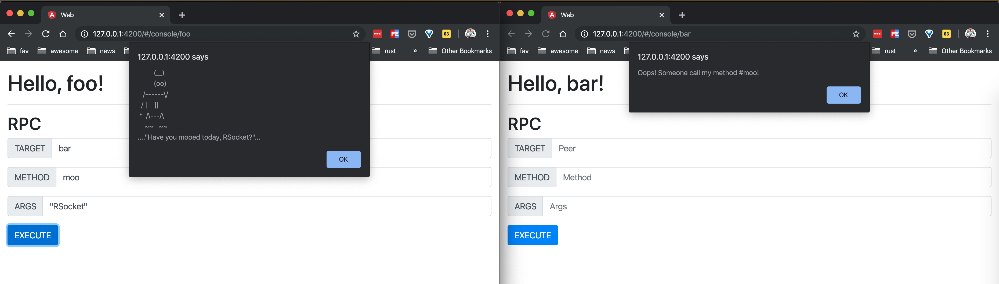

# RSocket MiniBroker

A mini broker demo on Reactive GreenTeaJUG.

### QuickStart

1. START Broker
```shell
$ ./gradlew run
```

2. Serve website. (Require angular-cli. see: https://cli.angular.io/)
```shell
$ cd web
$ ng serve
```
3. Open http://localhost:4200/

### Other

PPT is here: [RSocket_JUG.pdf](./RSocket_JUG.pdf)

### Screenshot

